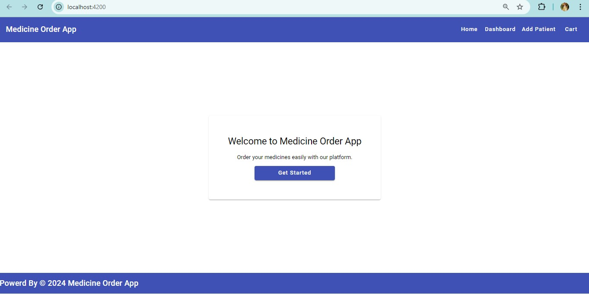
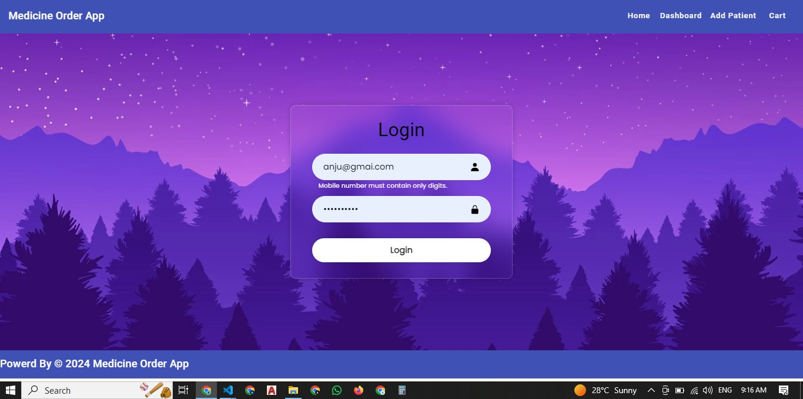
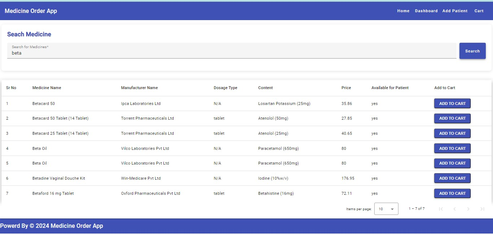
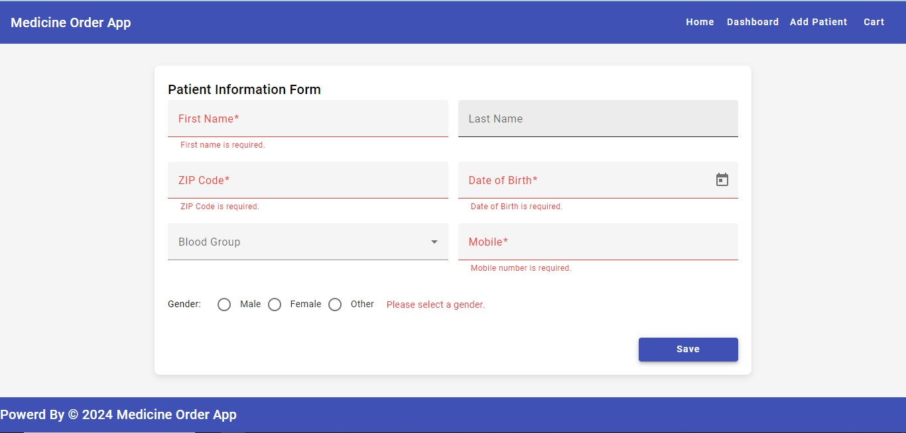
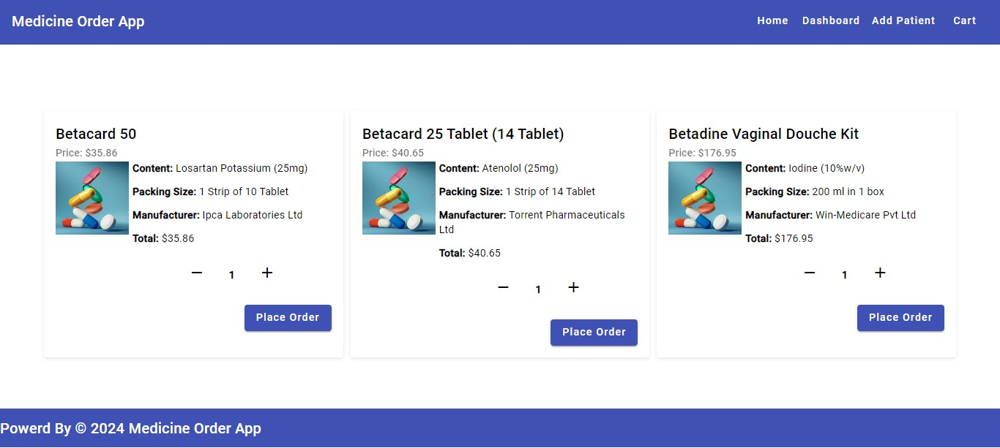

# medicine_app
Developed Medicine app with angular 17.

#Requirements
node -v
npm -v
Angular CLI: If you do not have the Angular CLI installed, you can install it globally using:
npm install -g @angular/cli

#Importnant notes regadring App
1) here node_modules is not required if you have already in your system, we can manage single node_module for multiple projctes, if we create multiple nodemodule that may reduce performance of application load.
2) I have implemented this application with angular 17 standalone components, so that might be not wokring some fetures like ngrx, dependency with angular lower version like angular v2 to v16., update you npm and install latest node version to run angular 17.
3) Implemented NGRX library to manage cart data. Used Angular material latest version for making form and theme. I have added bootstrap custome theme online for login page.

#steps to run application

#Step 1: Clone the Repository
First, clone the repository from GitHub to your local machine using the following command:
git clone https://github.com/anjalipatel-hub/medicine_app.git

#Step 2: Navigate to the Project Directory
cd medicine_app

#Step 3: Install Dependencies
Install the necessary dependencies using npm. Make sure you have Node.js installed (Node.js 16 or newer recommended).
npm install

#Step 5: Run the Application
After installing all dependencies, you can serve the application locally:
ng serve

#Step 6: Open the Application in Your Browser
http://localhost:4200

#ScreenShot of Application

